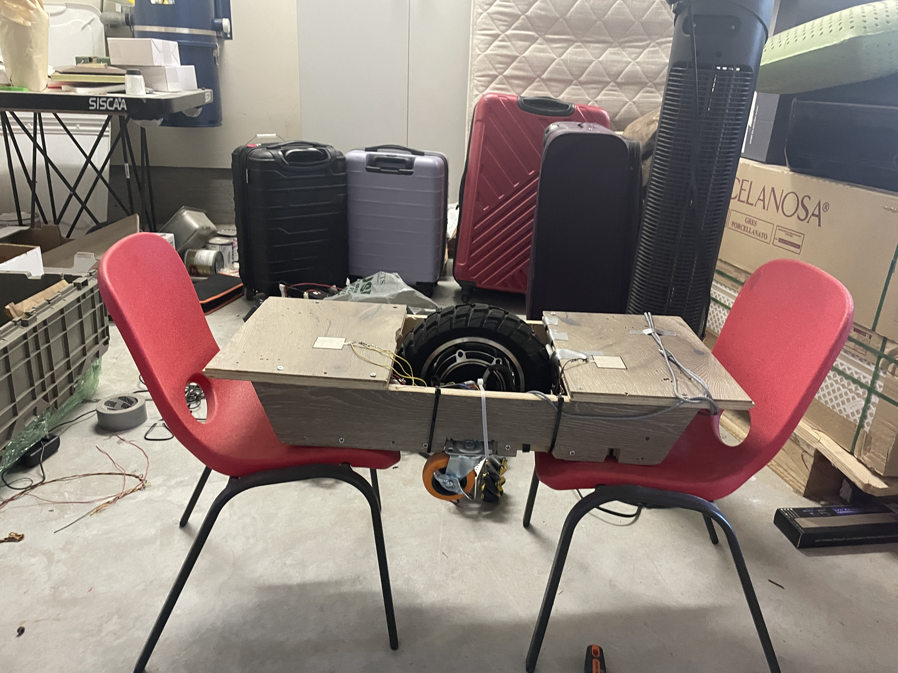

  

I built and programmed a Onewheel board which travels in the direction the hoverboard is tilting. It is fitted with 2 6-axis IMUs for relative angle tilt; absolute angle of the surface was calculated by regressing an acceleration vs angle curve at constant duty cycle. To detect if someone is standing on the pads, I mounted force-sensitive resistors and 10K resistors in series, read in the voltage across the FSR through analog IN, and mapped that value to whether the force measurement surpassed a certain threshold.

I attempted to do velocity control manually with a traditional ESC, but it was unsuccessful as balance requires rapid switching between positive and negative voltage which my ESC could not handle. Therefore, I upgraded to a VESC-based system, which allowed me to push reverse voltage to the motor. Additionally, it came with some convenient built-in libraries to build a balancing control system in the hardware.

