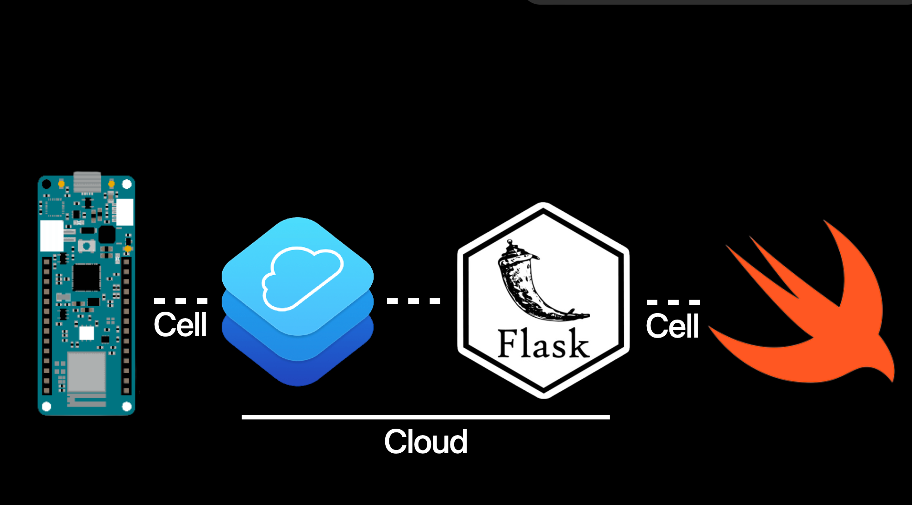
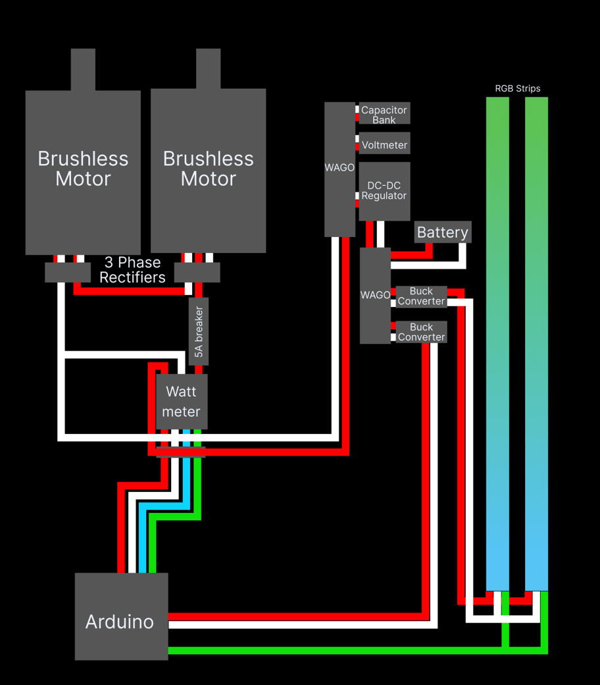
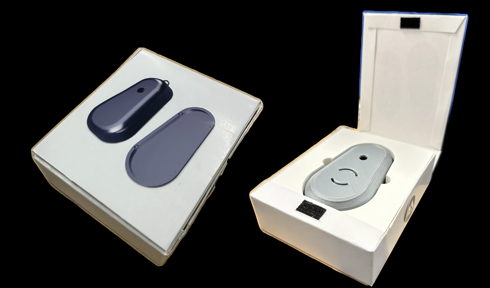

  
  
  

Seesaw (Apple Year 1)

I spent a summer at a camp hosted by Apple building an energy-generating seesaw with a full-stack iOS data app. I aided in the electrical design and implementation of the seesaw, capturing instantaneous power output through a current sensor on a Raspberry Pi and sending that data via HTTP to a Flask backend. I also implemented local data storage for user-based records with a plan to migrate to cloud storage.

Ventura Necklace (Apple Year 2)

Invited back in 2024 to mentor and lead a new project at Apple, my team developed a necklace for visually impaired users. This device provided environmental awareness via auditory and haptic feedback, driven by facial and object recognition models I implemented using OpenCV's Haar Cascades. I designed a priority-queue architecture to deliver timely, sequential, and duplicate-free information to the user via the ElevenLabs TTS API.

Highlights:

- Captured and streamed sensor data from embedded hardware to a Flask backend, paired with an iOS frontend for visualization and user interaction.
- Built facial/object recognition pipelines using OpenCV, integrated with a prioritized messaging system to surface the most relevant contextual information.
- Designed low-latency, duplicate-free notification delivery using a priority queue and ElevenLabs TTS for natural auditory feedback.
