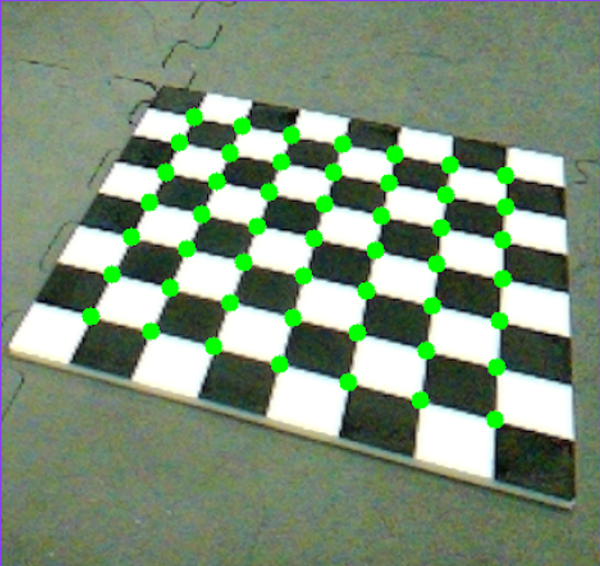
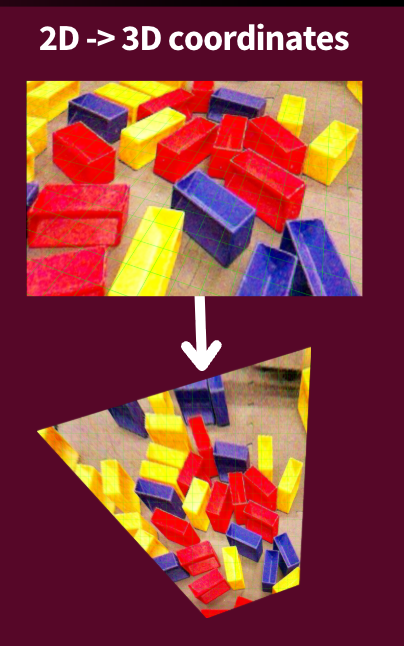

  
  
  

I led my FIRST Robotics software team, a role where I architected and maintained a large, high-performance software stack. This Java/Kotlin codebase, which I personally contributed over 36,000 lines of code to, helped us achieve the highest solo score of over 4,500 teams worldwide.

Key technical contributions:

- Architected a 36,000+ line Java/Kotlin software stack as Software Lead for a world-finalist team, achieving the highest solo score among 4,500 teams.
- Developed a real-time localization system by fusing ML vision, odometry, and ultrasonic data with Kalman Filters for precise on-field navigation.
- Implemented a motion-profiled Bézier curve follower and managed complex concurrency with Kotlin Coroutines and Finite State Machines (FSMs) for parallelized autonomous execution.
- Onboarded and trained 12 new student software developers over 3 years, ensuring our technical excellence would be sustained long after I graduated.

I designed robust autonomous routines with motion profiling and Bézier-based path following, integrated a TensorFlow vision model into the localization pipeline, and managed concurrency and lifecycle concerns with Kotlin Coroutines and FSMs to ensure deterministic, reliable autonomous behavior under competition constraints.