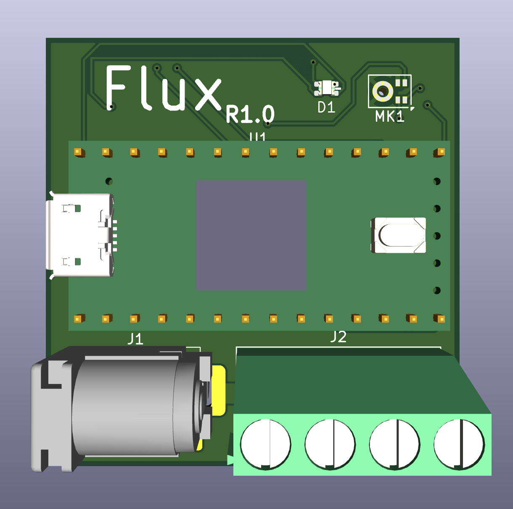
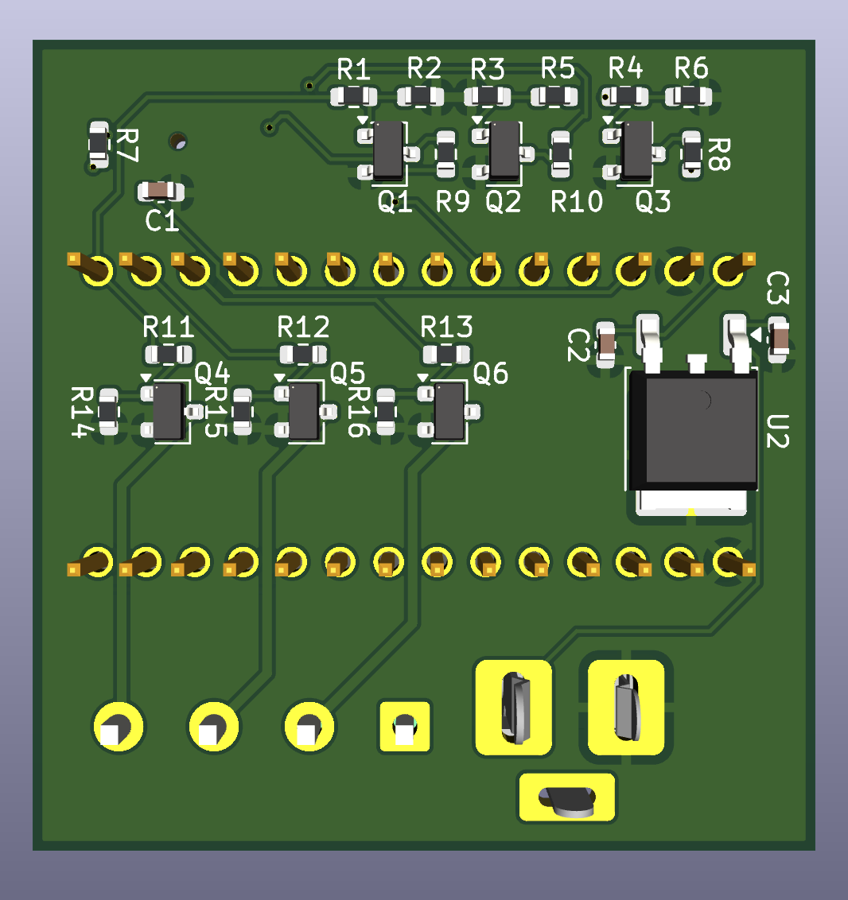
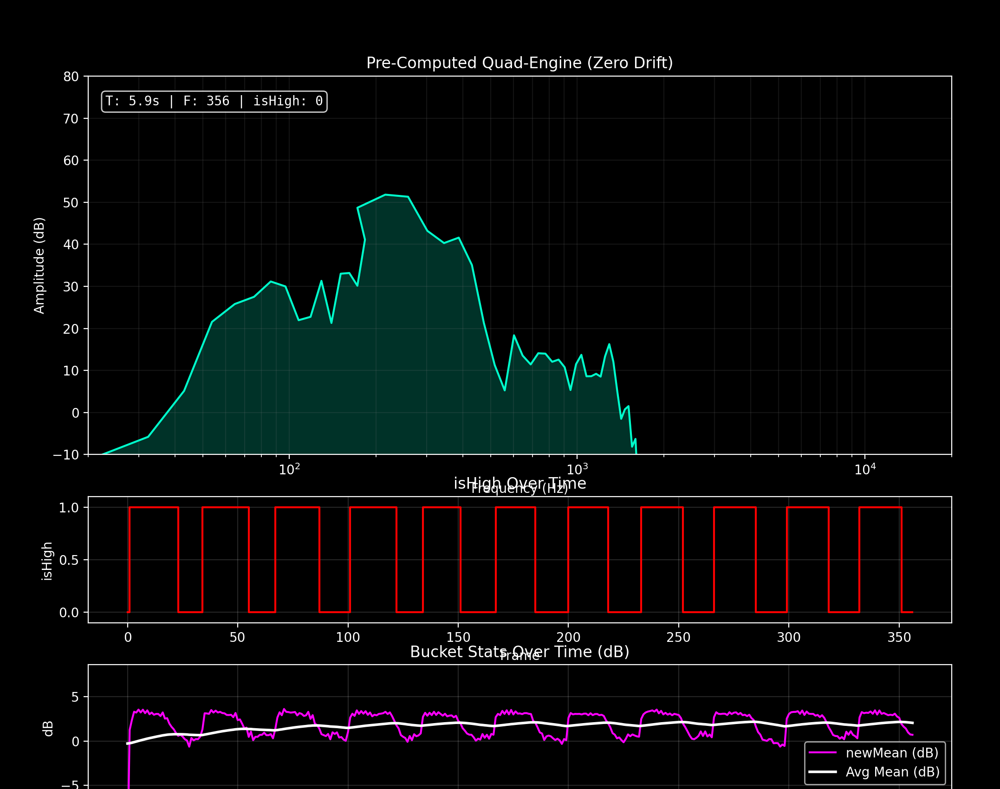

  

  
  
  

I engineered a custom PCB centered around a Teensy 4.0 to leverage its high clock speed for real-time FFT processing. I integrated a PDM digital microphone, which allows me to bypass analog noise by keeping the signal path purely digital. For power management, I implemented a linear regulator to stabilize the 12V input down to 5V for the logic components. To drive the high-current LED loads, I designed a multi-stage transistor array using MOSFETs; this configuration enables the 3.3V microcontroller signals to safely and rapidly switch the high-voltage 12V rails required for the RGB strips without introducing latency.

I developed a custom DSP pipeline designed to extract rhythmic intent rather than just reacting to raw volume. Starting with a Fast Fourier Transform (FFT) to shift audio into the frequency domain, I split the spectrum into targeted bins and calculated a running mean amplitude (visualized as the "pink line") smoothed by a low-pass filter to eliminate transient jitter. Each bin's signal is evaluated by measuring the deviation from a theoretical square wave and analyzing the ratio of high-to-low states. This logic allows the system to intelligently differentiate between random noise and a true beat, generating a clean binary isHigh signal that triggers lighting transitions only when the filtered data meaningfully exceeds the weighted mean.

Flux emphasizes deterministic, low-latency audio analysis and reliable high-current switching for immersive lighting effects.
