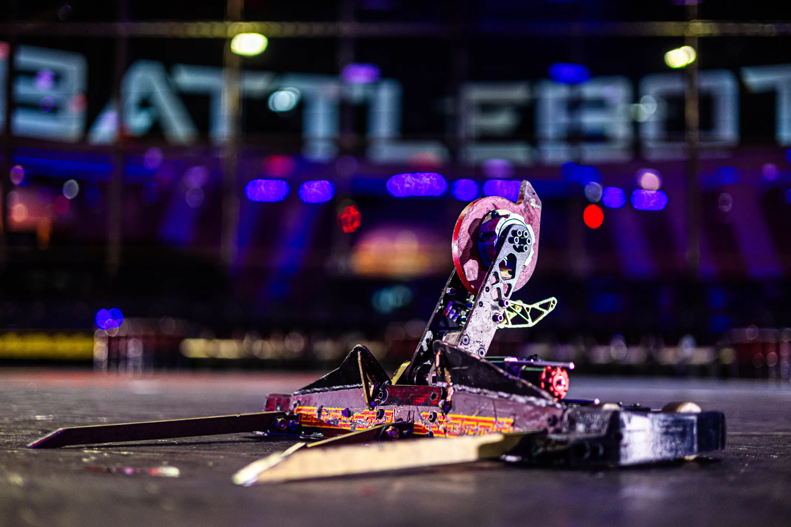
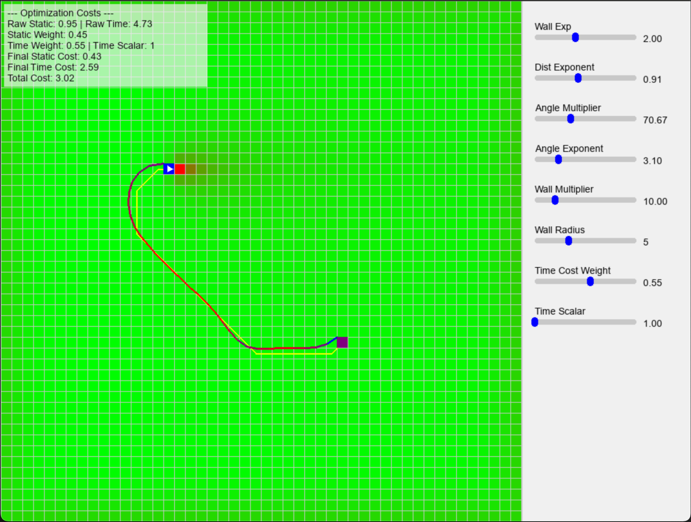
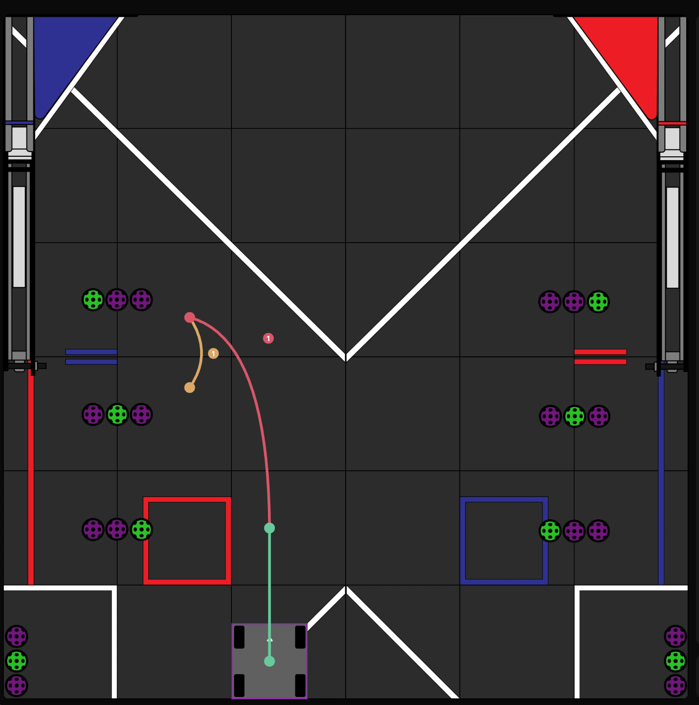

  
  
  
  <video class="ui medium right floated rounded image" controls>
    <source src="../images/ARC_Dynamic.mp4" type="video/mp4">
    Your browser does not support the video tag.
  </video>

I mentor a team of 8 student developers in C++ and Python to architect a high-performance pathfinding system in ROS2. I lead the development of our core optimization pipeline by implementing A* for path generation, mapping trajectories onto Bézier curves, and applying gradient descent to minimize cost under complex kinematic constraints.

- Lead and mentor a team of 8 student developers in C++ and Python to architect a high-performance pathfinding system in ROS2.
- Lead the core optimization pipeline by implementing A* for path generation, mapping trajectories to Bézier curves, and applying gradient descent to minimize cost under complex kinematic constraints.

The system emphasizes real-time performance, smooth drivable trajectories, and adherence to dynamic and kinematic limits. Mapping discrete A* outputs to Bézier representations enabled continuous, differentiable trajectories suitable for gradient-based refinement and smooth follower control in downstream motion planners.

Demonstrations include rendered Bézier mappings of A* outputs, the initial Bézier algorithm visualization, and a dynamic optimizer simulation (video) showing convergence to smooth, feasible trajectories under kinematic constraints.
